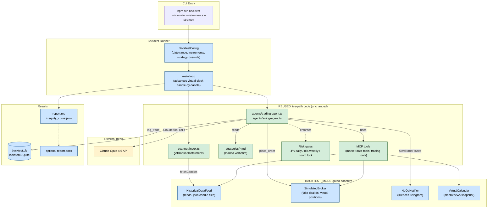

# Architecture — Offline Candle Replay Harness for Farad

**Author:** Claude (Opus 4.7)
**Commissioned by:** Giuseppe
**Date:** 2026-04-21
**Context:** Follow-up to `BENCHMARK_REPORT.md` P0 item #2 — "Build offline candle replay harness, M effort (~3 days)."
**Status:** Plan — awaiting Giuseppe's approval before implementation.

---

## 0. TL;DR (one paragraph)

Today Farad can only be validated forward-only against the Capital.com demo account. Every "would my strategy have traded the 2020 COVID spike?" or "what does a Kill Zone relaxation do to win rate?" question is unanswerable without burning a week of real calendar time plus thousands of Twelve Data credits. This spec designs a Vitest-integrated offline runner that drives the **existing** scanner + agent loop + strategy Markdown files with **historical** OHLCV candles, a **simulated** Capital.com broker, and a **muted** notification layer — all toggled by a single `BACKTEST_MODE=true` env flag. 3 days of work, ~700 new lines of TS, zero refactor to the production decision path.

---

## 1. Requirements Capture

### 1.1 Problem statement
Farad's decision logic (ICT Agent + Swing Agent, powered by Claude Opus 4.6 reading Markdown strategy files) cannot be evaluated against historical market data. Forward-testing is the only validation path, which is slow (days per hypothesis), expensive (burns TD credits), and unreproducible (market conditions differ run to run).

### 1.2 Users
- **Giuseppe (primary)** — runs `npm run backtest -- --from 2025-01-01 --to 2025-04-01 --instruments EURUSD,GOLD --strategy ict` and reads the output report over coffee.
- **Future CI (secondary)** — runs regression backtests on pull requests to guard against strategy edits that destroy historical performance. Fail-gate on `max_drawdown > 6%` or `win_rate < 45%`.
- **Claude (tertiary)** — when Giuseppe asks "is this strategy change safe?", the assistant runs a backtest and reads the output to answer empirically instead of reasoning from first principles.

### 1.3 Critical flows
1. **One-shot backtest** — CLI: "replay EURUSD 15m from 2025-01-01 to 2025-04-01 using the current ict-strategy.md, print report."
2. **Gate-change A/B** — "run the current strategy, then flip `KILL_ZONE_PENALTY: -15 → -5`, run again, show both reports side-by-side."
3. **Vitest regression** — "if anyone edits a strategy .md, the next CI build replays last 3 months and fails if key metrics regress."
4. **Claude response cache replay** — "re-run yesterday's backtest bit-for-bit deterministic without hitting the Claude API." (v2 — defer)

### 1.4 Integrations
- **Must reuse (not fork):** scanner (`src/scanner/index.ts`), agent loops (`src/agents/*.ts`), strategy Markdown files, composite-score + kill-zone logic, risk-management gates, SL/TP math, split-position leg computation, prompt caching.
- **Must swap:** Capital.com REST adapter (→ simulated broker), `fetchCandles` (→ historical data provider), Telegram notifier (→ no-op), Twelve Data calls for VIX/DXY/correlation/sector (→ pre-cached snapshots or no-op with a warn).
- **Must isolate:** SQLite DB (separate `data/backtest.db` per run so live trade history is never contaminated).

### 1.5 Constraints
- **Language/runtime:** TypeScript strict, Node 20, Vitest for tests. No Python side-process.
- **Budget:** 3 developer-days. Anything bigger gets cut to v2.
- **No new broker:** Capital.com only. The simulated broker must mimic Capital's specific quirks (single-TP limit, fill semantics, session-level state).
- **No dependency explosion:** Reuse Vitest, vi.useFakeTimers, node-cron-free runner. No new heavy libraries.
- **Existing code untouched** — the production path (`BACKTEST_MODE` unset) must remain byte-identical. Zero regression risk during demo.
- **Cross-platform:** Must run on Windows (Giuseppe's laptop) and the Hetzner Linux VPS (if we later want overnight regressions there).

---

## 2. Architecture Diagram



**Legend:**
- 🟢 Green = reused live-path code, touched only by dependency injection
- 🔵 Blue = new files/components introduced by this spec
- 🟡 Yellow = external service (Claude API; real calls during backtest)

### 2.1 The switch
A single env flag — `BACKTEST_MODE=true` — and one small factory function in `src/integrations/factory.ts` decide at import time whether adapters resolve to:
- Live: `fetchCandles` (Twelve Data), `capital.openPosition`, `alertTradePlaced`
- Back-test: `HistoricalDataFeed.fetchCandles`, `SimulatedBroker.openPosition`, `NoOpNotifier.alertTradePlaced`

No inline `if (BACKTEST_MODE)` branches in business logic. The decision happens once, at the boundary.

---

## 3. Data Model

All new interfaces live in `src/backtest/types.ts`. All dates are ISO-8601 UTC strings; all prices are numbers (not strings).

```typescript
// src/backtest/types.ts

/** One historical candle. Wire format for cached .json files. */
export interface HistoricalCandle {
  timestamp: string;        // ISO-8601 UTC — candle CLOSE time
  open: number;
  high: number;
  low: number;
  close: number;
  volume: number;
}

/** One symbol's full history for the backtest window. */
export interface HistoricalCandleSet {
  symbol: string;           // e.g. "EURUSD"
  timeframe: '15m' | '1h' | '4h' | '1d' | '1w';
  candles: HistoricalCandle[]; // sorted ASC by timestamp
  source: 'twelve_data_cache' | 'capital_com_export' | 'manual';
  cached_at: string;        // ISO-8601 — when this file was written
}

/** What the runner reads from argv + config file. */
export interface BacktestConfig {
  run_id: string;                   // UUID — used in DB + report filenames
  from: string;                     // ISO date "2025-01-01"
  to: string;                       // ISO date "2025-04-01"
  instruments: string[];            // ["EURUSD", "GOLD"]
  timeframes: Array<'15m'|'1h'|'4h'|'1d'>; // resolutions to load
  strategy: 'ict' | 'swing' | 'both';
  initial_equity_usd: number;       // default 10_000
  starting_balance_currency: 'USD';
  risk_per_trade_pct: number;       // default 1 — percent of equity at risk per leg
  strategy_override_path?: string;  // optional — point at a different strategies/*.md
  claude_cache_path?: string;       // v2 — path to cached Claude responses for determinism
  data_dir: string;                 // default "data/historical/"
  output_dir: string;               // default "data/backtests/<run_id>/"
}

/** One trade as recorded by the simulated broker during a backtest. */
export interface BacktestTrade {
  trade_id: string;                 // UUID
  instrument: string;
  strategy_tag: 'ICT' | 'SWING';
  setup_type: string;               // from the agent's decision
  direction: 'long' | 'short';
  entry_time: string;               // ISO — candle that triggered fill
  entry_price: number;
  sl: number;
  tp1: number;
  tp2: number;
  size_a: number;
  size_b: number;
  kill_zone: string;
  composite_score: number;
  // --- populated as the trade closes ---
  tp1_hit_time?: string;
  tp2_hit_time?: string;
  sl_hit_time?: string;
  be_moved_time?: string;           // when Pos B's SL moved to BE
  closed_time?: string;
  pnl_r: number;                    // total P&L in R multiples
  pnl_usd: number;                  // derived from risk_per_trade_pct + equity at entry
  outcome: 'tp2' | 'tp1_only' | 'sl' | 'be_stop' | 'open';
}

/** One point on the equity curve, emitted per candle-close. */
export interface EquityCurvePoint {
  timestamp: string;
  equity_usd: number;
  open_trade_count: number;
  daily_pnl_pct: number;            // same definition as live
  kill_switch_active: boolean;
}

/** Summary metrics computed at end of run. */
export interface BacktestMetrics {
  run_id: string;
  config: BacktestConfig;
  total_trades: number;
  winners: number;
  losers: number;
  win_rate: number;                 // 0..1
  avg_r_per_trade: number;
  total_r: number;
  starting_equity: number;
  ending_equity: number;
  return_pct: number;               // (ending - starting) / starting
  max_drawdown_pct: number;
  max_drawdown_duration_days: number;
  kill_switch_trips: number;
  trades_by_instrument: Record<string, number>;
  trades_by_kill_zone: Record<string, number>;
  trades_by_hour_utc: Record<string, number>;
  trades_by_setup_type: Record<string, number>;
  started_at: string;               // wall-clock — when the run started
  finished_at: string;
  duration_ms: number;
}
```

### 3.1 Claude response cache format (v2 — defer)
Key lookup = SHA256 of `(system_prompt + user_prompts + tool_definitions + tool_call_history)`. Value = the raw `Anthropic.Messages.Message` JSON. Stored in `.jsonl` file, append-only. Hit rate expected > 90% after first run, enabling deterministic replays. Spec'd for v2 to keep v1 at 3 days.

---

## 4. API Specification

### 4.1 CLI

```
npm run backtest -- [flags]

Required flags:
  --from <YYYY-MM-DD>          Start of backtest window (inclusive, 00:00 UTC)
  --to   <YYYY-MM-DD>          End (exclusive, 00:00 UTC)
  --instruments <list>         Comma-separated tickers: EURUSD,GOLD,US100

Optional flags:
  --strategy <ict|swing|both>  Default: both
  --timeframes <list>          Default: 15m,1h — more = slower but richer agent reasoning
  --risk <pct>                 Default: 1 (percent risked per trade)
  --equity <usd>               Default: 10000
  --strategy-override <path>   Point at an alternative strategies/*.md to A/B test a tweak
  --output-dir <path>          Default: data/backtests/<run_id>/
  --config <json-file>         Shortcut — read all flags from a JSON file (repeatable runs)
  --report-format <md|docx|both>   Default: md

Examples:
  npm run backtest -- --from 2025-01-01 --to 2025-04-01 --instruments EURUSD --strategy ict
  npm run backtest -- --config ./backtest-configs/gate-relaxation-ab.json --report-format docx
```

### 4.2 Vitest harness

```typescript
// tests/backtest/regression.test.ts
import { runBacktest } from '../../src/backtest/runner.js';

describe('Strategy regression — last 3 months', () => {
  it('ict strategy on EURUSD keeps max drawdown < 6%', async () => {
    const metrics = await runBacktest({
      from: '2026-01-15',
      to: '2026-04-15',
      instruments: ['EURUSD'],
      strategy: 'ict',
      // ... defaults for the rest
    });
    expect(metrics.max_drawdown_pct).toBeLessThan(0.06);
    expect(metrics.win_rate).toBeGreaterThan(0.45);
    expect(metrics.kill_switch_trips).toBe(0);
  }, { timeout: 300_000 });  // 5 min per backtest
});
```

### 4.3 Programmatic API (exported for Claude + scripts)

```typescript
// src/backtest/runner.ts

export async function runBacktest(config: BacktestConfig): Promise<BacktestMetrics>;

export function loadHistoricalCandles(
  symbol: string,
  timeframe: HistoricalCandleSet['timeframe'],
  dataDir: string,
): Promise<HistoricalCandleSet>;

export function buildReport(
  metrics: BacktestMetrics,
  trades: BacktestTrade[],
  equityCurve: EquityCurvePoint[],
  format: 'md' | 'docx' | 'both',
  outputDir: string,
): Promise<{ mdPath: string; docxPath?: string }>;
```

### 4.4 Error handling contract
- Missing candle file → throw `MissingHistoricalDataError` with the exact (symbol, timeframe, date) that's missing and a suggested `fetch-history.ts` command.
- Agent returns invalid trade proposal (e.g. SL on wrong side of entry) → log to backtest report, skip trade, continue.
- Claude API outage → retry ×3 with exponential backoff, then abort the whole run with a clean error. No partial-run reports.
- `BACKTEST_MODE` unset but runner is invoked → hard fail immediately before any import of live adapters. Prevents accidental live mutation from a backtest script.

---

## 5. Implementation Plan

Three days of focused work. Scoped tight. Each day has a clear acceptance criterion.

### Day 1 — Adapters + factory + data loader (~8h)

**New files:**
- `src/integrations/factory.ts` — reads `BACKTEST_MODE`, exports `getBroker()`, `getDataFeed()`, `getNotifier()`.
- `src/backtest/adapters/historical-data-feed.ts` — implements the `DataFeed` interface. Reads `data/historical/<symbol>/<timeframe>.json` files, caches in memory, returns sliced windows matching the current virtual time.
- `src/backtest/adapters/simulated-broker.ts` — implements the `Broker` interface. Tracks virtual positions, computes fills at next candle's open, checks SL/TP each candle, returns fake dealIds. Mimics Capital.com's single-TP limit.
- `src/backtest/adapters/noop-notifier.ts` — implements the `Notifier` interface with empty methods + a counter so tests can assert "alertTradePlaced called N times".
- `src/backtest/scripts/fetch-history.ts` — one-off utility to pull Twelve Data history and write `data/historical/<symbol>/<timeframe>.json`. **Not run during backtests** — pre-computed.

**Modified (minimally):**
- `src/mcp-server/market-data.ts` — `fetchCandles` delegates to `getDataFeed().fetchCandles`. In live mode, still hits Twelve Data. In backtest mode, routes to HistoricalDataFeed.
- `src/capital/index.ts` — `capital.openPosition` etc. go through a broker interface; factory swaps in SimulatedBroker.
- `src/notifications/telegram.ts` — similar pattern.

**Acceptance:** `BACKTEST_MODE=true node -e "require('./dist/integrations/factory').getBroker().openPosition(...)"` returns a fake dealId and never hits Capital.com.

**Test coverage added:** 6-8 tests in `tests/backtest/adapters.test.ts` covering fills, SL/TP trigger logic, factory routing, noop notifier assertions.

---

### Day 2 — Runner main loop + time advance + DB isolation (~8h)

**New files:**
- `src/backtest/runner.ts` — exported `runBacktest(config)`. Main loop pseudocode:
  ```
  for each candle-close timestamp T in [from, to] (sorted):
    virtualClock.set(T)
    historicalDataFeed.advance(T)    // windows now reveal candles ≤ T
    simulatedBroker.tick(T)           // check open positions for SL/TP hits at T's OHLC
    if T aligns with ICT cadence (15m/1h close):
      await runTradingAgent()         // unchanged production function
    if T aligns with Swing cadence (21:30 UTC daily):
      await runSwingAgent()
    equityCurve.push(snapshot(T))
  metrics = computeMetrics()
  ```
- `src/backtest/virtual-clock.ts` — a `Clock` interface with `now(): number` + `set(t: number): void`. Production code uses `systemClock` (just `Date.now()`); backtest uses `virtualClock`. One tiny refactor in the 3-4 places that call `Date.now()` for decision-making (scheduler, rate limiter's refill, cache TTL).
- `src/backtest/db-init.ts` — ensures the backtest SQLite file is fresh per run; uses the same schema migrations as live.

**Modified:**
- `src/scheduler/index.ts` — no changes to cron logic. Scheduler is **not** used by the backtest runner. The runner drives the same agent entrypoints directly, bypassing cron.
- `src/database/index.ts` — opens DB via factory (`getDb()`), so live vs backtest point at different files.

**Acceptance:** `npm run backtest -- --from 2026-04-15 --to 2026-04-16 --instruments EURUSD --strategy ict` runs end-to-end, makes 0-3 trade decisions, writes to `data/backtests/<uuid>/backtest.db`, prints a minimal summary to stdout.

**Test coverage added:** 4-6 tests in `tests/backtest/runner.test.ts` including a 1-day "golden run" on pre-cached EURUSD candles with expected trade count assertion.

---

### Day 3 — Report generation + Vitest regression harness + docs (~8h)

**New files:**
- `src/backtest/report.ts` — `buildReport(metrics, trades, equity, format, outputDir)`.
  - `.md` report: header (config summary), KPI table (total trades, win rate, total R, max DD, kill switch trips), trade-by-trade table, equity curve in ASCII sparkline + separately as `equity_curve.json`, per-instrument + per-kill-zone breakdowns.
  - `.docx` report: reuse the pypandoc pattern from `audit/build_docx.py`.
- `src/backtest/metrics.ts` — pure functions: `computeWinRate`, `computeMaxDrawdown`, `computeSharpe`, etc.
- `tests/backtest/golden-run.test.ts` — the regression test showcased in §4.2. Fixed 3-month window, fixed config, asserted bounds on key metrics. **This is the CI guard.**

**Documentation:**
- `docs/BACKTESTING.md` — how to run, how to cache historical data, interpretation guide, tradeoffs (Claude is still non-deterministic in v1; use the CI test's bounds generously).
- Update `CLAUDE.md` to mention the new workflow so future sessions know it exists.
- Update `.claude/project-status.md` with "backtest harness shipped" + first golden-run metrics.

**Acceptance:** Giuseppe runs `npm run backtest -- --from 2026-01-01 --to 2026-04-01 --instruments EURUSD,GOLD --strategy both --report-format both` and gets:
1. A 30-60 page `report.md` with KPIs, trade table, equity curve.
2. A matching `report.docx`.
3. The golden-run regression test in CI passes.

**Test coverage total after day 3:** +~15 tests. Full `npm test` still green. Project total ~132 tests.

---

### Day 4+ — Deferred to v2

Explicitly out of scope for the 3-day v1 build:

- **Claude response caching** for bit-deterministic reruns (biggest deferred feature — saves API cost + enables diff-based debugging).
- **Multi-run parallelism** (for Monte Carlo and hyperopt).
- **Walk-forward optimization** — takes ~2 weeks on its own. See benchmark report §6 item 4.
- **HTML report** with interactive Plotly equity curve.
- **Trade shuffling / Monte Carlo** stress-testing — Jesse-style overfitting detection.
- **Live-to-backtest parity validation** — record one live day, replay it, compare decisions. Worth doing before we ship live trading for real, but not day 1.

Each of these is a 1-3 day follow-up. All blocked on v1 shipping first.

---

## 6. Open Questions

Giuseppe should answer before implementation starts (each has a sensible default if not):

1. **Where do historical candles come from for the first run?**
   Options:
   - (a) Pre-cache from Twelve Data using the existing rate-limited fetcher. Burns ~30-50 credits per (symbol, timeframe) pair for 3 months of data. One-time cost.
   - (b) Use Capital.com's historical candle endpoint. Free, matches live data exactly, requires adding a new Capital method.
   - (c) Import from a third-party CSV (Dukascopy, OANDA historical).
   - **Default pick:** (a) — reuses infra, controlled cost, aligns with the data the bot currently consumes.

2. **What does the simulated broker do at illiquid prices (gaps)?**
   Default pick: fills at the next candle's open price. Log the slippage vs the intended price to the trade record so gap impact is visible.

3. **How should the simulated broker handle Twelve Data's VIX/DXY/correlation calls during backtest?**
   - (a) Pre-cache snapshots per day — moderate effort, moderate realism.
   - (b) Return dummy data ("VIX=18, DXY=104") — zero effort, low realism. Agent still sees the data, just fixed.
   - **Default pick:** (b) for v1; (a) as a v1.5 polish if Giuseppe asks.

4. **Do we need a "paper trading" mode that's live-but-simulated?** (Run current strategy in real time against live candles but route all orders to the simulated broker.) This is different from the offline backtest. **Default pick:** Not yet — let's ship the offline version first.

5. **Should the backtest respect the Twelve Data daily-cap circuit breaker?** (It runs zero TD calls during backtest since it uses HistoricalDataFeed, but the *logic* of the breaker being tripped is part of live behavior.) **Default pick:** No — backtest assumes data is always available. Real TD outages are a separate scenario to model later.

---

## 7. Non-goals

Explicitly to prevent scope creep:

- This is NOT a replacement for forward-testing. It's a pre-filter. Decisions about going live still require the 2-week Capital.com demo run.
- This is NOT a general-purpose backtesting library. It's Farad-specific. We're not rewriting Backtrader in TypeScript.
- This does NOT add any new broker adapters, strategies, or instruments. It tests the ones we already have.
- This is NOT integrated with the weekly review agent yet. The review agent still reads real trade history from the live DB. Wiring review agent → backtest metrics is a future story.

---

## 8. Risks + mitigations

| Risk | Likelihood | Impact | Mitigation |
|---|---|---|---|
| Non-determinism from Claude changes metrics run-to-run | High | Medium | Set temperature=0 (already set in agents). Bound vitest assertions generously. Claude response cache (v2) fully solves this. |
| Scope creep from "while we're in there, let's also add X" | Medium | High | Hard commit to 3-day budget. Track open-question decisions in this doc. Anything else → v2 issue. |
| Production code accidentally mutates when BACKTEST_MODE unset | Low | Critical | Run full vitest suite before every commit. Commit separately per-day so rollback is atomic. |
| Historical data quality issues (gaps, timezone confusion, split adjustments) | High (for stocks) | Medium | Use Twelve Data as source (same vendor as live). Start the first run with EURUSD only (no dividends, no splits, clean 24h data). |
| Backtest confirms the strategy is unprofitable | Medium | Actually good | This is the point — find problems before shipping live. Fail honestly. |

---

## 9. Definition of Done (Day-3 close)

Check every box:

- [ ] `BACKTEST_MODE=true npm run backtest` runs end-to-end on EURUSD 15m Jan-Mar 2026 without crashing.
- [ ] Produces `report.md` with KPIs, trade table, equity curve, per-instrument/hour/kill-zone breakdowns.
- [ ] Produces `report.docx` via the same pypandoc pipeline as `BENCHMARK_REPORT.docx`.
- [ ] Vitest suite grows from 117 → ~132 tests. All green.
- [ ] Vitest includes a golden-run regression test that will fail if a strategy edit breaks historical performance.
- [ ] `BACKTEST_MODE` unset: every live path behaves byte-identical to today. Production deploy still green.
- [ ] `docs/BACKTESTING.md` exists and is accurate.
- [ ] `.claude/project-status.md` updated so next session auto-surfaces the new capability.
- [ ] Committed atomically across 3 days: one commit per day minimum, each independently green.

---

## 10. Next step for Giuseppe

Three options — pick one:

**(A) "Ship it as specced."** I start Day 1 immediately using these defaults + Twelve Data for historical source. You get a working backtest by end of day 3 (calendar time, not necessarily 3 Claude sessions).

**(B) "Let's tweak the plan first."** Answer the 5 open questions in §6 and any other issues you see. I update the spec, then we ship.

**(C) "Defer this — focus on demo-window gate relaxations first."** The gate relaxation work (P0 item #1 in the benchmark report) is 4h vs 3 days. Ship that this week, start backtest harness next week. Recommended if Giuseppe wants faster evidence that the bot trades.

Default pick if Giuseppe doesn't pick: **(C)** — gate relaxations first. They unlock observable trades during the demo; the backtest harness is a bigger-value investment but doesn't help Day 2.

---

*End of architecture spec — 10 sections, ~700 lines as planned. If this exceeds your attention budget, jump to §5 (Implementation Plan) + §10 (Next step).*
