# Farad Trading Bot — System Flowchart

**Repo HEAD:** `265beff` (feat(prompt): STEP 3 L0 sizing feasibility pre-flight (L3b-2))
**Generated:** 2026-05-09 — read-only investigation, A-to-Z architecture map.

This document is the navigation map of the codebase. Every decision branch carries a `file.ts:NNN-NNN` citation so you can jump straight to source. Diagrams are Mermaid (renders in GitHub + VS Code Mermaid preview).

---

## Section 0 — Master Component Map

The seven first-class runtime actors and their data/control links. Arrow labels = trigger.

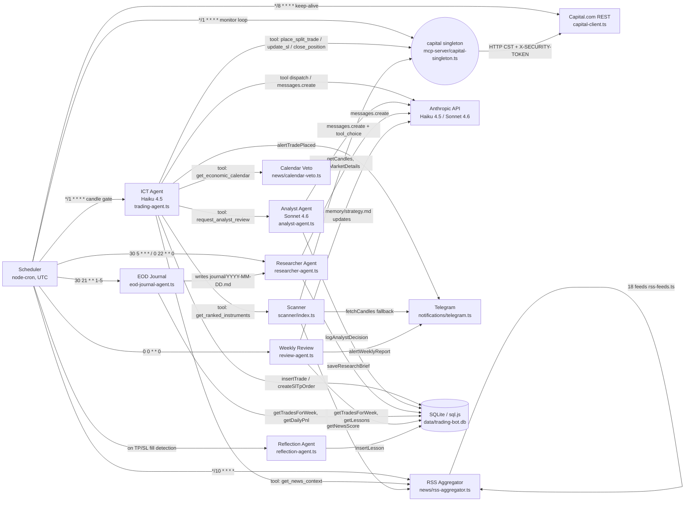

Reading the arrows: `Scheduler -->|"*/1 * * * *"| ICT` means the scheduler's 1-minute cron is what wakes the ICT agent. The candle-close gate inside that cron decides whether the agent actually runs.

---

## Section 1 — Boot Sequence

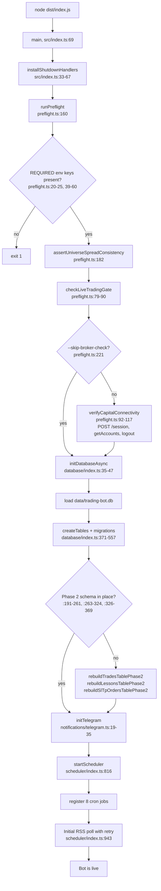

### Cron Registration Table

| Pattern (UTC) | Job | Registered at | Trigger |
|---|---|---|---|
| `*/1 * * * *` | Split-position monitor + candle-close detect → ICT Agent | `scheduler/index.ts:829-891` | Every minute |
| `*/8 * * * *` | Capital.com session keep-alive ping | `scheduler/index.ts:894` | Every 8 minutes |
| `30 5 * * *` | Market Researcher (daily, pre-London) | `scheduler/index.ts:897-899` | Daily 05:30 UTC |
| `0 22 * * 0` | Market Researcher (weekly outlook) | `scheduler/index.ts:902-904` | Sunday 22:00 UTC |
| `0 0 * * 0` | Weekly Review Agent | `scheduler/index.ts:919-921` | Sunday 00:00 UTC |
| `30 21 * * 1-5` | EOD Journal Agent | `scheduler/index.ts:927-929` | Mon-Fri 21:30 UTC |
| `*/10 * * * *` | RSS news poll (18 feeds) | `scheduler/index.ts:934-936` | Every 10 minutes |
| `5 0 * * *` | Reject metrics dump (spawned `npx tsx`) | `scheduler/index.ts:950-960` | Daily 00:05 UTC |

Every job is wrapped with `{timezone: 'UTC'}` (`scheduler/index.ts:700`) — Hetzner is UTC+1/+2, so without this the EOD cron would fire at 19:30 UTC instead of 21:30.

---

## Section 2 — ICT Cycle (the heart)

The ICT cycle is the highest-stakes path in the system. Every minute the cron checks whether to wake the agent; when it does, the agent runs a 5-step decision cycle that may end in a trade.

### The Gate

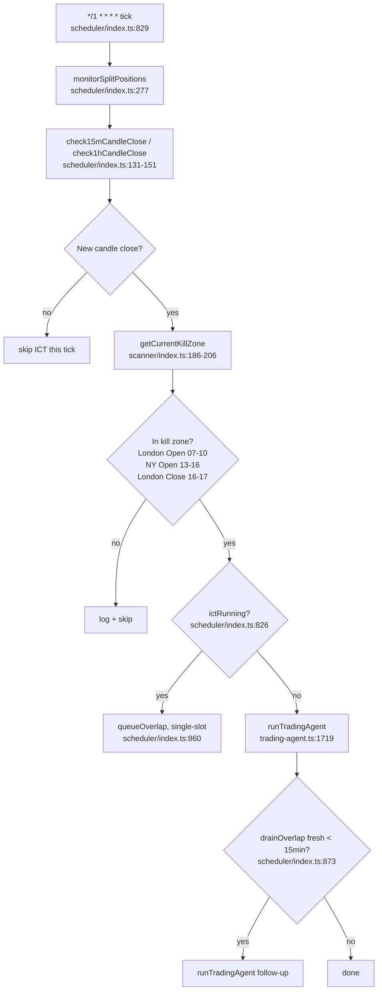

`ictRunning` is a per-process mutex (`scheduler/index.ts:826`); the monitor mutex is separate (`monitorRunning`, line 825) so a slow agent never blocks position management.

### The Agent Loop

`runTradingAgent` (`trading-agent.ts:1719-1993`) is the agentic Anthropic-tool loop:

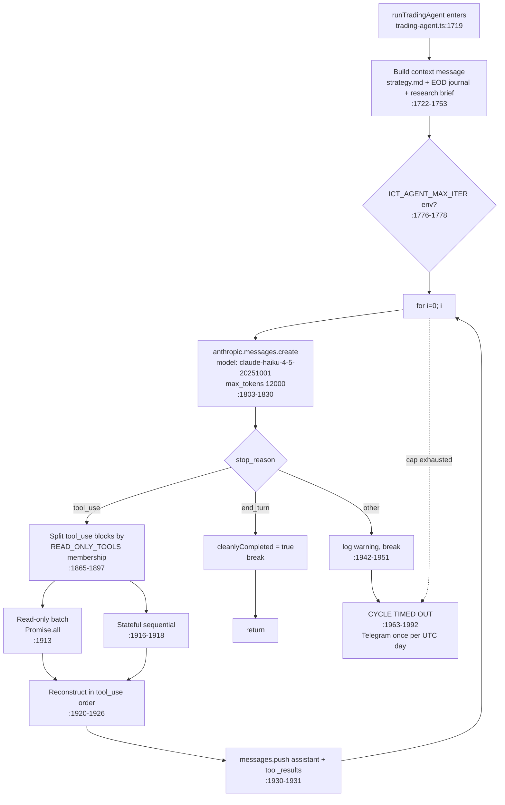

**Iteration cap:** `12` (`:1778`), bumped from `8` on 2026-05-09 because NFP Friday 2026-05-08 surfaced 5 of 12 cycles hitting the 8 cap. Override via env `ICT_AGENT_MAX_ITER` 1..50.

**Per-iteration timeout:** 90s (`:1787`). 12 iterations × 90s ≈ 18min worst case, bounded.

**Read-only tools (run parallel):** `get_daily_pnl`, `get_portfolio`, `get_ranked_instruments`, `get_prices`, `get_news_context`, `get_economic_calendar`, `get_lessons` (`trading-agent.ts:589-597`). Stateful tools (`request_analyst_review`, `place_split_trade`, `update_sl`, `close_position`) run sequentially in emission order.

### The 5-Step Cycle (per `prompts/ict-agent.md:97-303`)

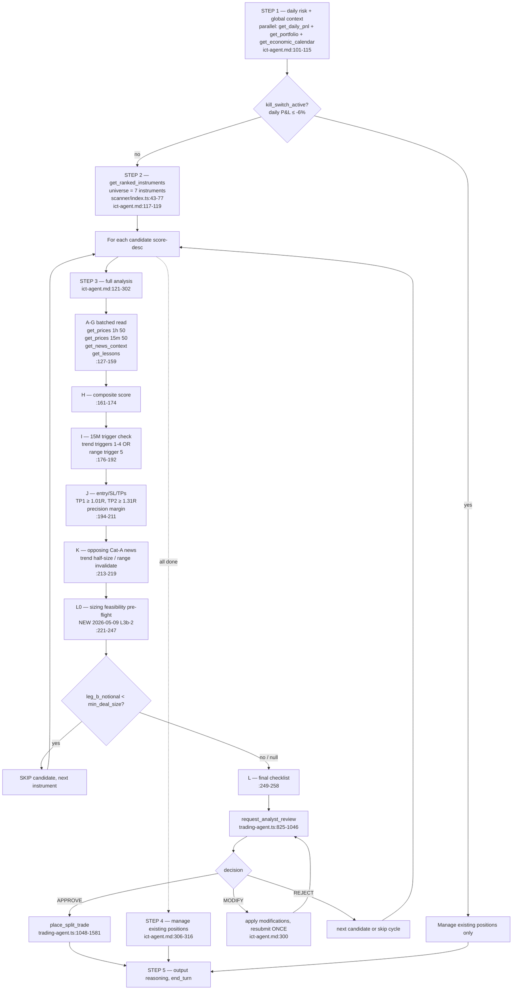

### L0 Sizing Feasibility — the formula

The new 2026-05-09 L0 pre-flight (`prompts/ict-agent.md:221-247`):

```
leg_b_notional = (balance × tier_risk_pct / 100) × 0.30 / |entry − sl|
```

`tier_risk_pct`: **1.5** Tier 1 / **1.0** Tier 2 / **0.5** Tier 3 (trend) / **0.25** range-mode.

**Decision:**

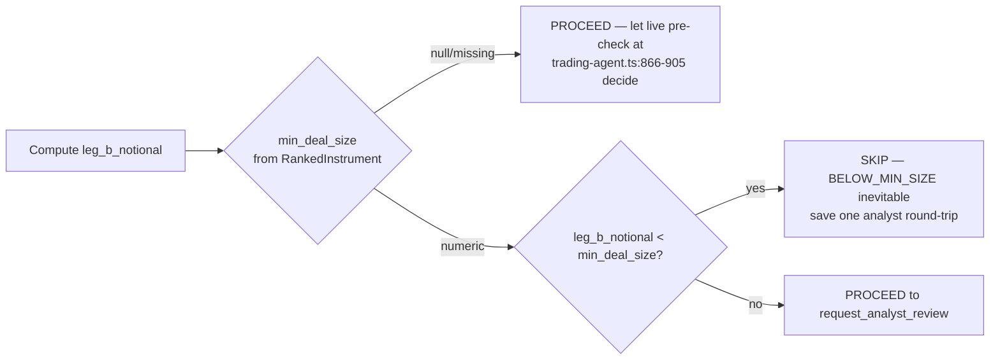

`min_deal_size` is populated on every `RankedInstrument` since 2026-05-09 (`scanner/index.ts:497-511`). The cache is module-level (`scanner/index.ts:272-303`) with in-flight promise dedup; cleared on pm2 restart.

### Stop reasons recap

- `end_turn` — clean completion (`trading-agent.ts:1842-1846`)
- cap-hit (12 iterations, no end_turn) — `CYCLE TIMED OUT` log + once-per-day Telegram (`:1963-1991`)
- `max_tokens` / `stop_sequence` / `pause_turn` — log warning, break, mark abnormal (`:1942-1951`)
- non-`tool_use` other — same as above

---

## Section 3 — Analyst Agent Decision Tree

The Analyst is the second pair of eyes. Sonnet 4.6 with `tool_choice = submit_decision` (forced tool call) so the JSON can never be lost to truncation (`analyst-agent.ts:251-318`).

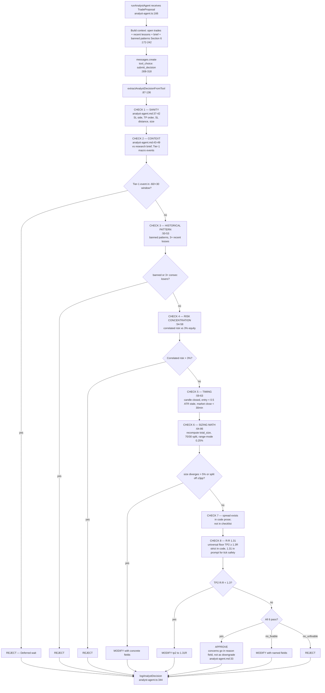

**Calibration targets** (`analyst-agent.md:7-11`): APPROVE 60-80%, MODIFY 5-15%, REJECT 15-25%.

The structured `decision` field is the ONLY authority — the prose `reason` is human-readable context (`ict-agent.md:298`). Empty `modifications` on a MODIFY is invalid (`analyst-agent.md:29`).

Hard-failure mode (timeout / API error / parse failure) returns `{decision:'REJECT', confidence:0, reason:'...'}` (`analyst-agent.ts:319-330, 38-71`).

---

## Section 4 — Trade Execution Pipeline

`place_split_trade` is the atomic, validated, compensating placement tool (`trading-agent.ts:1048-1581`).

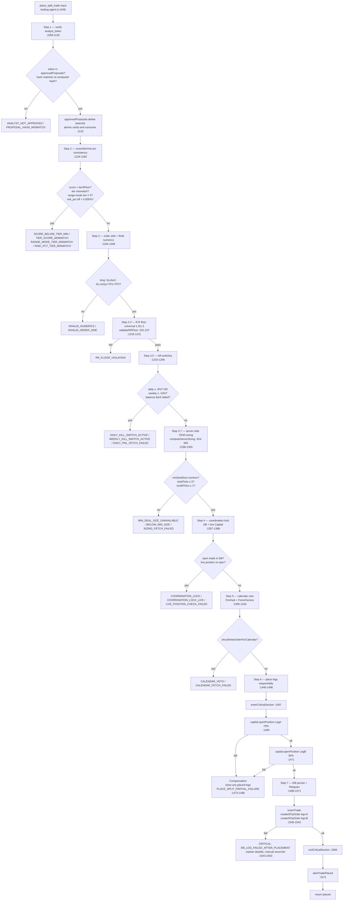

Each `Eα` branch returns a structured `{error, reason}` JSON to the LLM. The LLM reads the `reason` and either skips, fixes, or retries on the next cycle.

The critical-section markers (`enterCriticalSection` / `exitCriticalSection`) are read by the `SIGTERM` handler (`src/index.ts:33-67`) which polls `getCriticalSectionDepth()` for up to 1.4s before flushing the DB. Pre-fix a `pm2 restart` mid-placement could leave a position live on Capital with no DB row.

---

## Section 5 — Split-Position Monitor Loop

`monitorSplitPositions` runs every minute (`scheduler/index.ts:277-426, 829-839`).

State machine for one trade:

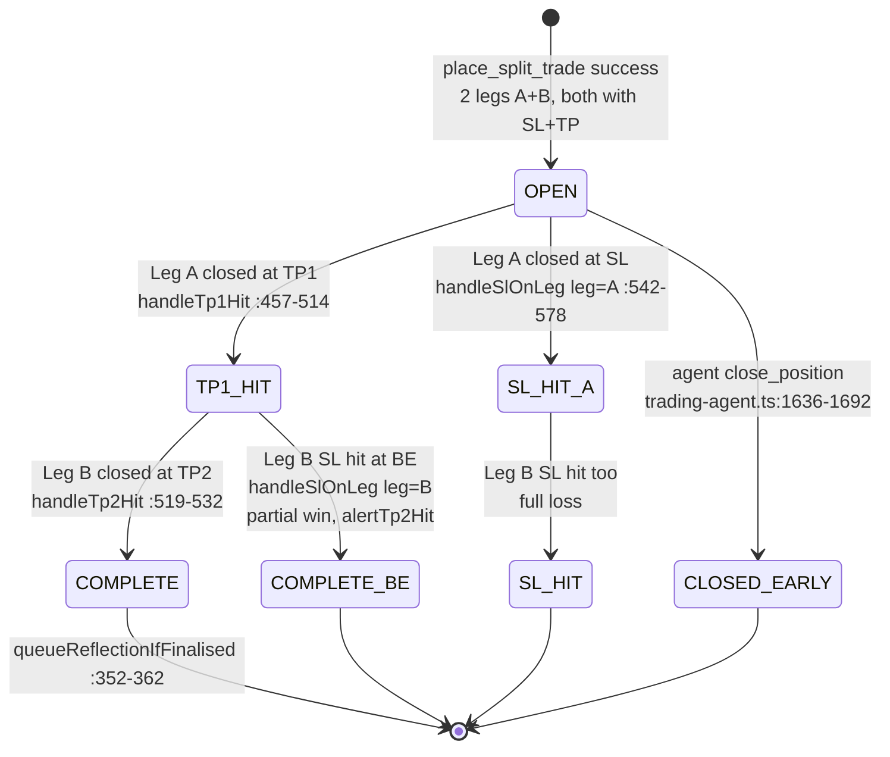

### Per-tick flow

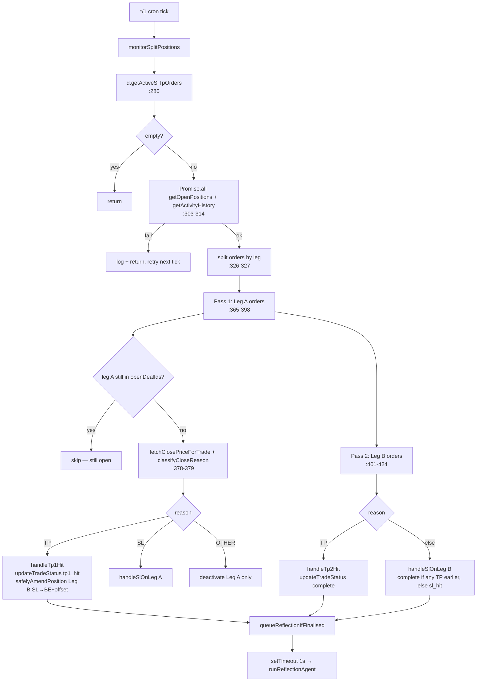

### `classifyCloseReason` — three tiers (`scheduler/index.ts:187-259`)

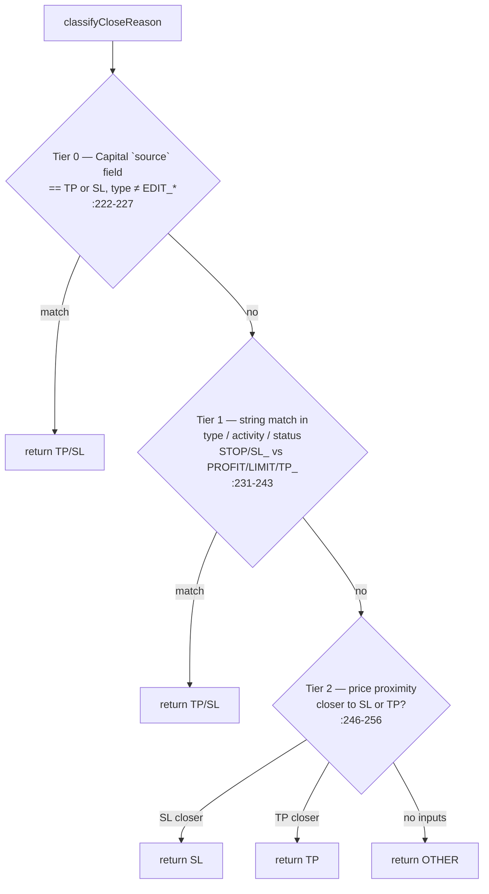

Tier 0 was the 2026-05-07 SILVER incident fix: an `EDIT_STOP_AND_LIMIT` activity caused Tier 1 to return `'SL'` on what was actually a TP fill. Capital's `source` field (`'TP'`/`'SL'`/`'USER'`/...) is now the authoritative read.

---

## Section 6 — Background Jobs

| Job | Cron | Where | Reads | Writes |
|---|---|---|---|---|
| **Market Researcher (daily)** | `30 5 * * *` | `researcher-agent.ts`, scheduled at `scheduler/index.ts:897` | yield curve, sectors, economic calendar, RSS news | `research_briefs` table via `saveResearchBrief` |
| **Market Researcher (weekly)** | `0 22 * * 0` | same agent | same | same |
| **EOD Journal** | `30 21 * * 1-5` | `eod-journal-agent.ts`, scheduled at `scheduler/index.ts:927` | `getTradesForWeek`, `getDailyPnl`, `getLatestBrief`, `getLessons` | `journal/YYYY-MM-DD.md` (file) — preamble for next day's ICT cycle via `loadRecentJournal` (`eod-journal-agent.ts:67-91`) |
| **Weekly Review** | `0 0 * * 0` | `review-agent.ts`, scheduled at `scheduler/index.ts:919` | `getTradesForWeek`, `getLessons`, `getLessonWinRate` | `memory/strategy.md` updates (file) + Telegram `alertWeeklyReport` |
| **RSS Poll** | `*/10 * * * *` | `news/rss-aggregator.ts`, scheduled at `scheduler/index.ts:934` | 18 feeds (`news/rss-feeds.ts:39+`), Tier 1/2/3 | in-process cache (`POLL_FRESH_MS = 10min`, `rss-aggregator.ts:35`); merged with MarketAux on `getNewsScore` |
| **Capital keep-alive** | `*/8 * * * *` | `scheduler/index.ts:894`, `pingKeepAlive` at `:645-676` | none | Telegram alert on 3-failure streak (`PING_ALERT_THRESHOLD = 3`, `:615`) |
| **Reject metrics dump** | `5 0 * * *` | `scheduler/index.ts:950-960`, spawns `npx tsx scripts/dump-reject-metrics.ts` (detached) | pm2 logs / DB | log file |
| **Reflection (event-triggered)** | not cron — fires on TP/SL fill detection | `scheduler/index.ts:761-778` (decideReflectionQueue) | trade row + closed PnL | `lessons` table via `insertLesson` |

The Researcher's regime classification is deterministic from yield-curve shape + sector dispersion (`researcher-agent.ts:24-58`), not LLM. Themes are LLM-extracted via forced `submit_themes` tool call (`:71+`).

---

## Section 7 — External Integrations

### Capital.com REST (`mcp-server/capital-client.ts`)

- **Auth flow:** POST `/api/v1/session` with `X-CAP-API-KEY` + `{identifier, password}`. Response headers carry `CST` + `X-SECURITY-TOKEN` (`capital-client.ts:1-14`).
- **Session idle:** 9 minutes of no activity triggers re-auth (`SESSION_IDLE_MS = 9*60_000`, `:73`). Capital times out at 10. Keep-alive cron `*/8` keeps it warm.
- **Deal-confirm polling:** 25 attempts, mild backoff 1.08× starting 200ms (`DEAL_CONFIRM_*`, `:82-84`). Up to ~10s wall — pre-fix the 2s tight bound caused duplicate placements when the second call timed out.
- **Singleton:** `mcp-server/capital-singleton.ts` (28 lines) is the leaf module imported by scanner, scheduler, trading-agent — broken out to avoid scanner ↔ trading-agent cycle (commit `9d42b2c`, 2026-05-09).
- Env vars: `CAPITAL_API_KEY`, `CAPITAL_IDENTIFIER`, `CAPITAL_API_KEY_PASSWORD`, `CAPITAL_API_URL` (default demo). `LIVE_TRADING_OK=true` required to start against the live URL (`preflight.ts:79-90`).

### Anthropic API

All agents use Claude via the Anthropic SDK (Haiku 4.5 + Sonnet 4.6). The bot does **not** use Gemini despite some early planning docs referring to it.

| Agent | Model | File |
|---|---|---|
| ICT Trading | `claude-haiku-4-5-20251001` | `trading-agent.ts:1814` |
| Trade Analyst | `claude-sonnet-4-6` | `analyst-agent.ts:309` |
| Researcher | (Haiku — themes via tool call) | `researcher-agent.ts` |
| EOD Journal | Haiku 4.5 | `eod-journal-agent.ts:8-11` |
| Weekly Review | (forced `submit_review` tool call) | `review-agent.ts:53+` |
| Reflection | Haiku 4.5 | `reflection-agent.ts:13-16` |

**Tool surface available to ICT agent** (`trading-agent.ts:599-749`):

| Tool | Read-only? | Purpose |
|---|---|---|
| `get_daily_pnl` | yes | running P&L, equity, kill switch |
| `get_portfolio` | yes | live Capital.com positions |
| `get_ranked_instruments` | yes | scanner output, includes `min_deal_size` since 2026-05-09 |
| `get_prices` | yes | OHLC fetch |
| `get_news_context` | yes | per-instrument news score |
| `get_economic_calendar` | yes | Finnhub upcoming high/medium/low |
| `get_lessons` | yes | filtered past lessons |
| `request_analyst_review` | NO (spawns sub-LLM, mutates approval map) | mandatory pre-trade gate |
| `place_split_trade` | NO | atomic 2-leg placement |
| `update_sl` | NO | move SL on all active legs |
| `close_position` | NO | early close one leg |

ICT loops: Anthropic SDK default 600s per call, overridden to 90s via `withTimeout` (`trading-agent.ts:1787, 1830`). Analyst: 60s (`analyst-agent.ts:304`).

System prompts use `cache_control: { type: 'ephemeral' }` for prompt caching (`trading-agent.ts:1827`, `analyst-agent.ts:311`).

### Telegram (`notifications/telegram.ts`)

| Alert | Function | Trigger |
|---|---|---|
| New trade placed | `alertTradePlaced` (`:85-104`) | every successful `place_split_trade` |
| TP1 hit | `alertTp1Hit` (`:106-114`) | Leg A close on TP fill |
| TP2 / complete | `alertTp2Hit` (`:116-127`) | Leg B close on TP fill or partial-win finale |
| SL hit | `alertSlHit` (`:129-137`) | full loss |
| Kill switch | `alertKillSwitch` (`:139-147`) | daily 6% / weekly 10% |
| Weekly report | `alertWeeklyReport` (`:149-153`) | Sunday review |
| System warning | `alertSystemWarning` (`:155-157`) | degraded env, ICT cap-hit (1×/UTC day), ping streak ≥ 3 |
| Research brief | `alertResearchBrief` (`:159-162`) | researcher warnings |

Telegram `parse_mode: Markdown`, `mdEsc()` escapes `_*`[]` from LLM-supplied content, fall-through to plain text on parse failure (`:54-81`).

### SQLite via sql.js (`database/index.ts`)

In-process WASM SQLite. File path: `data/trading-bot.db` relative to dist (`:24`). The DB is held in memory; `saveToFile()` flushes on every write (`:51-59`). `getCriticalSectionDepth()` lets `SIGTERM` drain in-flight writes before final flush (`:872-882`, `index.ts:30-67`).

---

## Section 8 — Data Persistence

The DB has **6 tables only** (no `candles_cache`, no `news_articles` table — those live in process memory):

| Table | Schema cite | Written by | Read by |
|---|---|---|---|
| `trades` | `database/index.ts:380-407` | `insertTrade` (`:562-656`), `updateTradeStatus` (`:658-679`), `markTradeClosedEarly` (`:1018`) | scheduler monitor, analyst (open trades), reflection, weekly review, ICT coordination lock |
| `lessons` | `:411-438` | `insertLesson` (`:767`), `reflection-agent` post-close | ICT `get_lessons`, analyst `getLessons`, weekly review |
| `research_briefs` | `:441-447` | `saveResearchBrief` (`:900-914`) | ICT `getLatestBrief`, analyst |
| `analyst_log` | `:450-460` | `logAnalystDecision` (`:935-944`) | weekly review (calibration metrics) |
| `sl_tp_orders` | `:463-479` | `createSlTpOrder` (`:945-979`), `deactivateSlTpOrder` (`:1040`), `updateSlPrice` (`:1030`) | scheduler monitor every minute |
| `daily_pnl_log` | `:531-543` | `upsertDailyPnl` (`:1047-1066`) | ICT kill-switch check, EOD journal, weekly review |

### Migrations applied on the latest deploy

The schema is rebuilt idempotently on every boot when needed. Phase 2 (2026-05-09) is the most recent change, applied automatically the first time a 265beff process starts on a Phase 1 DB:

- **`rebuildTradesTablePhase2`** (`:191-261`) — drops `tp3`, `position_c_id`, `size_c`, `pnl_c` columns; drops `'tp2_hit'` from status CHECK. Migrates any `tp2_hit` rows to `closed_early`.
- **`rebuildLessonsTablePhase2`** (`:263-324`) — drops `position_c_outcome`, `pnl_c_r` columns.
- **`rebuildSlTpOrdersTablePhase2`** (`:326-369`) — drops `'C'` from leg CHECK; deletes any historical Leg C rows.

Each rebuild has a fast-exit guard at the top so subsequent boots are no-ops (`:197, 265, 329`).

---

## Section 9 — Recent Significant Changes (2026-05-09 ship)

The `master..HEAD` window since 2026-05-08 contains six concurrent specs:

### Spec 1 — Cap + L1 + observability (`f35c7e6`)
- ICT iteration cap **8 → 12** (`trading-agent.ts:1764-1778`). NFP Friday surfaced 5/12 cycles cap-hitting.
- L1 read-only/stateful split: `Promise.all` for `READ_ONLY_TOOLS` set, sequential for stateful (`trading-agent.ts:589-597, 1865-1897`).
- ICT cap-hit Telegram alert dedup (1×/UTC day, `:1981-1991`).

### Spec 3 — L3a parallel batching + L3b-1 1.31R precision
- Threads through STEP 1 + STEP 3 batched-read directives in `prompts/ict-agent.md:103-110, 125-133`.
- Precision rule TP2 ≥ **1.31R** (was 1.30R) added at `prompts/ict-agent.md:202, 209`. Strict floor in `validateRRFloor` (`trading-agent.ts:201-237`) is still 1.0/1.3 — the +0.01 is a defensive prompt-side margin against broker tick rounding.

### 3-leg removal Phase 1 + Phase 2
- **Phase 1** (commit `3335a7a`, 2026-05-08): drop `tp3`/`size_c` from TS types + tests + LLM proposal contract (`analyst-agent.ts:138-164`).
- **Phase 2** (HEAD): drop columns + status enum value at the DB layer (`database/index.ts:191-369`). Idempotent migrations.

### MODIFY-misread guard (`prompts/ict-agent.md:298-301`)
- 2026-05-08 incident: 9 MODIFY responses, agent gave up on 8 (mistook prose for verdict). Fixed by hardening the prompt: "structured `decision` field is the ONLY authority. The analyst's `reason` prose is human-readable context, not authority."

### Analyst calibration (commits `6580a44`, `b29c9ad`, `58f7f81`, `9703929`)
- New `analyst-agent.md:7-11` calibration band (APPROVE 60-80%).
- New `DECISION RULE` table (`analyst-agent.md:19-33`).
- CHECK 6 + CHECK 8 rewrites with explicit Tier-1 macro event handling and Cat-A range-mode invalidation (`analyst-agent.md:43-49, 54-58, 64-86`).

### L3b-2 Leg-B notional pre-flight (just shipped at `265beff`)
- New file: `src/mcp-server/capital-singleton.ts` (28 lines, leaf module).
- Scanner: `min_deal_size` cache + `getMinDealSizeFor` helper (`scanner/index.ts:272-303`).
- Scanner: `getRankedInstruments` augments every result with `min_deal_size` via `Promise.all` (`scanner/index.ts:497-511`).
- Prompt: STEP 3 L0 directive `prompts/ict-agent.md:221-247`.
- Threading: agent runs L0 *before* `request_analyst_review`; the live pre-check at `trading-agent.ts:866-905` remains as the defensive last gate.

The worked example in the prompt is concrete: SILVER on a $1012 demo balance at Tier 2 with a 0.78-point SL gives Leg B ≈ 3.89 units, below SILVER's `min_deal_size = 5`. L0 catches this and saves the analyst round-trip.

---

## Section 10 — Known Inconsistencies & Latent Bugs

Surfaced by an independent Codex code-trace cross-check on 2026-05-09. Listed worst-first. None block today's ship; **all worth scheduling a small follow-up commit.**

### P1 — Phase 2 migration left dead column references

After the 3-leg removal Phase 2 dropped `position_c_id` from the `trades` table, two places still reference it:

| Reference | Risk | Fix |
|---|---|---|
| `database/index.ts:1006` — `getTradeByDealId` SQL still selects `position_c_id` | Will throw `no such column: position_c_id` next time it runs on a Phase-2 DB | Remove `OR position_c_id = ?` from the query; remove the third bind param |
| `database/index.ts:947` — `createSlTpOrder` parameter type still allows `leg: 'A' \| 'B' \| 'C'` | TS compiles fine; runtime hits CHECK constraint `leg IN ('A','B')` and throws | Tighten type to `'A' \| 'B'` |
| `scheduler/index.ts:12-13` — comment still describes 3-leg behaviour | Misleading documentation only | Update comment |
| `agents/trading-agent.ts:1514` — comment references dropped columns | Misleading documentation only | Update comment |

`getTradeByDealId` is called by the position monitor on every minute that has a closed activity record — so this will manifest the first time a trade closes after the next deploy. Worth a same-day fix.

### P2 — `get_daily_pnl` read/write classification conflict

| Layer | Treatment | File |
|---|---|---|
| MCP tool definition | upserts `daily_pnl_log` (write) | `mcp-server/tools/db-tools.ts:69-83` |
| ICT agent loop | listed in `READ_ONLY_TOOLS` set, runs in `Promise.all` batch | `trading-agent.ts:589-597` |

If the agent emits `get_daily_pnl` alongside another read in the same iteration, both run concurrently and the upsert race could double-write the same row. Fixed by either (a) moving `get_daily_pnl` to stateful, or (b) making the upsert idempotent under concurrency (it likely already is via SQLite WAL, but worth verifying).

### P2 — Scanner ranking cache TTL is `0`

`scanner/index.ts:244-245` — `RANKING_CACHE_TTL_MS = 0` means the cache map is allocated but never serves a hit. Every `getRankedInstruments` call re-does the full Capital fetch (1h candles for all 7 instruments). At one cycle per kill-zone candle close (~16/day), this is ~112 candle fetches/day vs. the ~16 needed. Not a bug — likely intentional during validation — but worth knowing for cost analysis.

### P3 — `prompts/ict-agent.md` and `validateRRFloor` intentionally desynced

| Layer | Threshold |
|---|---|
| `prompts/ict-agent.md:209` | TP2 ≥ 1.31R |
| `trading-agent.ts:201-237` `validateRRFloor` | TP2 ≥ 1.30R (strict) |

The +0.01 in the prompt is a **defensive margin** so that broker tick-rounding doesn't push a 1.300R proposal below the 1.30R code floor. This is load-bearing — don't "fix" the desync.

### P3 — Stale comments

- `scanner/index.ts:15` says "20 instruments" — actual `INSTRUMENT_UNIVERSE` is 7
- `scheduler/index.ts:5` still describes 3-leg Leg-C trail logic — only A/B handled
- Cosmetic only; no runtime impact.

### P3 — `DB_LOG_FAILED_AFTER_PLACEMENT` is unrecoverable

`trading-agent.ts:1543-1563` — if `insertTrade` / `createSlTpOrder` fails *after* both legs are live on Capital, the code returns an error JSON to the LLM but does **not** roll back the live positions. Result: orphan positions on Capital with no DB row. The monitor won't see them. Manual reconcile required.

In practice this requires sql.js write failure on a healthy DB — extremely rare. But worth a scheduled compensation: if the DB write fails, attempt `capital.closePosition` on both deal IDs, then alert.

---

## Reading guide

- For "what runs when?" → Section 0 + Section 1 cron table.
- For "how does a trade actually get placed?" → Section 4.
- For "why did Leg B's SL move?" → Section 5.
- For "what does the agent see at decision time?" → `prompts/ict-agent.md` (the system prompt) + Section 2.
- For "what just shipped today?" → Section 9.
- For "what's broken or stale that's not blocking ship?" → Section 10.
